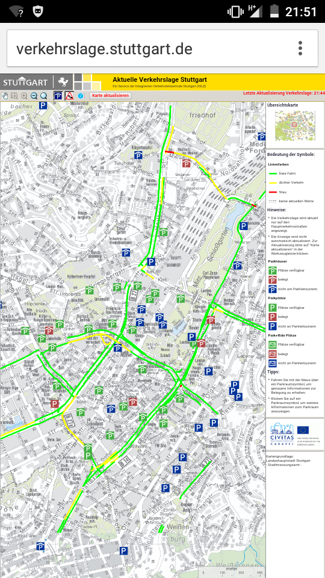

# Webscraping mit Python

- Mic92 ([github](https://github.com/Mic92)/[twitter](https://twitter.com/Mic_92))
- [github.com/offenesdresden/ParkAPI/](https://github.com/offenesdresden/ParkAPI/)
- Slides & Code: [github.com/Mic92/webscraping-workshop](https://github.com/Mic92/webscraping-workshop)

# Motivation

- Parkplatzübersicht Stuttgart auf Android

# Motivation

- Automatisierung
- Statistiken/Langzeitdaten
- Andere Darstellung/Mashups
