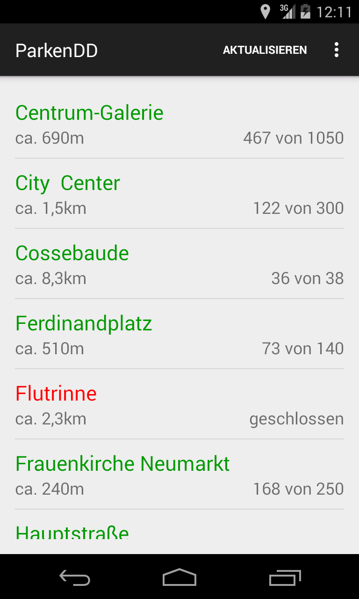

# Webscraping
## (mit Python)

- Mic92 ([github](https://github.com/Mic92)/[twitter](https://twitter.com/Mic_92))
- [github.com/offenesdresden/ParkAPI/](https://github.com/offenesdresden/ParkAPI/)
- Slides & Code: [github.com/Mic92/webscraping-workshop](https://github.com/Mic92/webscraping-workshop)


## Ablauf

0. [Installation](https://github.com/Mic92/webscraping-workshop/)
1. Grundlagen
2. Vorführung am [Beispiel](http://www.freiburg.de/pb/,Lde/231355.html)
3. Ihr seit dran:
   - [Bregenz](https://www.bregenz.gv.at/sicherheit-verkehr/verkehr-und-parken/parkleitsystem.html)
   - [Andere Beispiele](https://github.com/offenesdresden/ParkAPI/issues?q=is%3Aclosed+label%3Anew_data+is%3Aissue)

Note:
- Grundlagen: HTML, DOM, CSS-Selektoren, XPath
- Beispiel: Parkplätze: Freiburg http://www.freiburg.de/pb/,Lde/231355.html
- Danach: Rüstzeug um selber los zulegen, Beispiele vorbereitet, aber auch
  eigene Beispiele möglich.


## Motivation

- Parkplatzübersicht Stuttgart auf Android

<a href="Screenshot_2015-10-23-21-51-37.png">
  
</a>


## Motivation

ParkenDD Apps:
<table>
<tr>
  <a href="ios-screen.jpeg">
    
  </a>

  <a href="android-screen.png">
    
  </a>
</tr>
</table>


## Motivation

- Automatisierung
- Statistiken/Langzeitdaten
- Andere Darstellung/Mashups


## Grundlagen

- Was brauchen wir:
  - eine Programmiersprache,  ✓ ([Python](python.org))
  - die Webseiten herunterladen kann ✓ ([Requests](http://docs.python-requests.org/en/latest/))
  - und parsen kann ✓ ([BeautifulSoup](http://www.crummy.com/software/BeautifulSoup/))

Note:
- Viele Programmiersprachen sind grundsätzlich geeignet.
- Ich bevorzuge dynamische Programmiersprachen, wegen interaktiven Shell (später
  mehr)
- Wir müssten wie der Browser HTTP sprechen, Python kann das von Haus aus.
  Requests ist aber schöner zu benutzen
- Letztendlich muss das HTML der Webseite ausgewertet werden


## Grundlagen - HTML

```html
<html>
  <head>
    <title>Präsidenten</title>
  </head>
  <body>
    <table id="präsidenten">
      <tr>
        <th>Präsidenten</th>
        <th>Regierungszeiten</th>
      </tr>
      <tr>
        <td>Abraham Lincoln</td>
        <td class="date">4. März 1861 - 15. April 1865</td>
      </tr>
      <tr>
        <td>Andrew Johnson</td>
        <td class="date">15. April 1865 - 4. März 1869</td>
      </tr>
      <tr>
        <td>Ulysses S. Grant</td>
        <td class="date">4. März 1869 - 4. März 1877</td>
      </tr>
    </table>
  </body>
</html>
```


## Grundlagen - CSS Selektoren

<table>
<tr><td>Selector</td> <td>Example</td> <td>Example description CSS</td></tr>
<tr><td>.class</td> <td>.date</td> <td>Wählte alle Zeilen mit der Klasse .date aus.</td></tr>
<tr><td>#id</td> <td>#präsidenten</td> <td>Wählt die Tabelle mit der ID Präsident aus.</td></tr>
<tr><td>element</td> <td>tr</td> <td>Wählt alle Zeilen der Tabelle aus.</td></tr>
<tr><td>Komplexbeispiel</td> <td>#präsidenten td:first-child</td> <td>1. Spalte der Präsidententabelle</td></tr>
</table>


## Grundlagen
